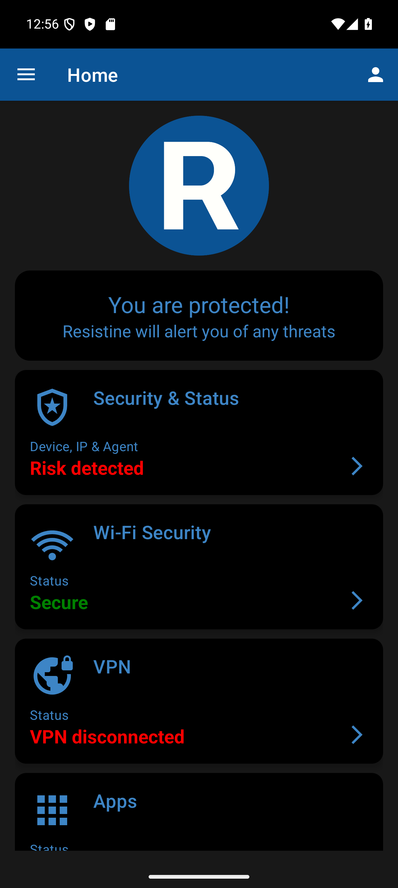
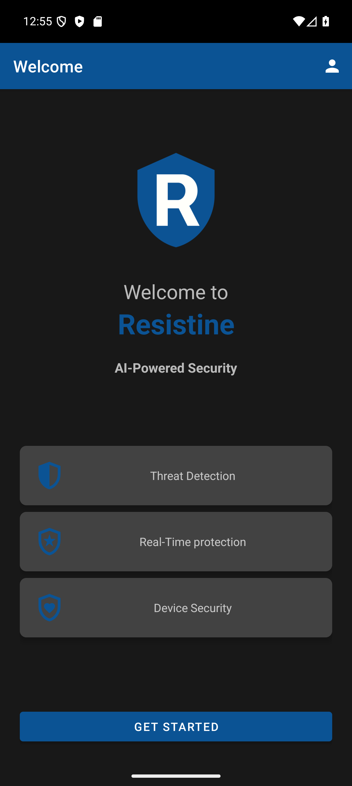
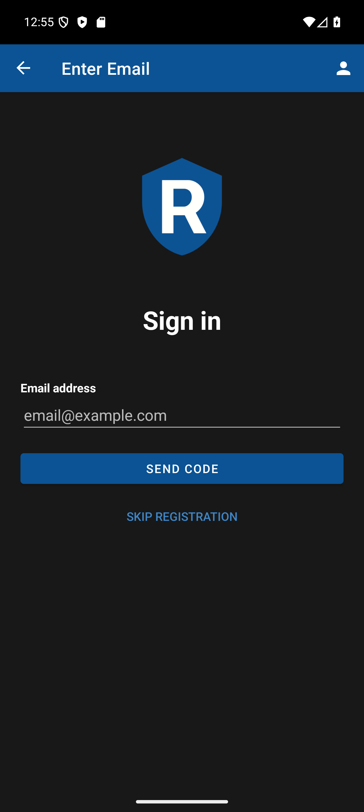
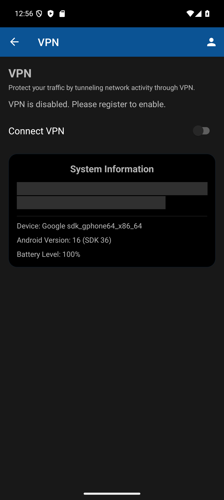
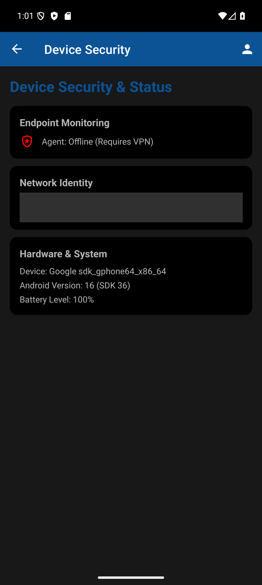
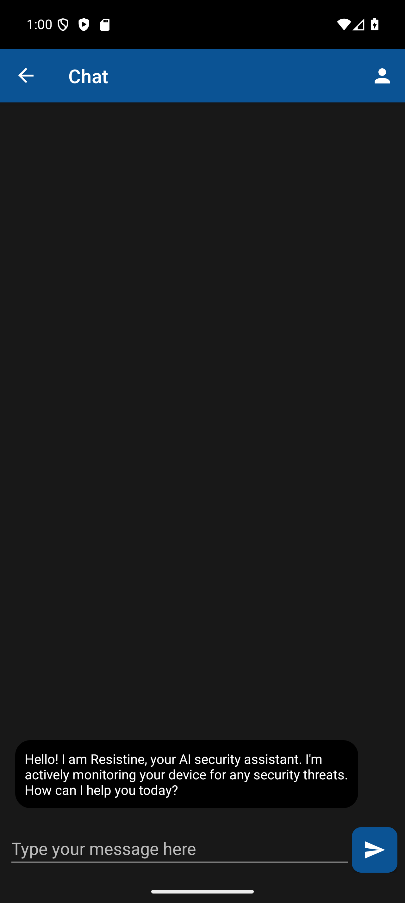

# Resistine Android User Documentation

Resistine is an Android security application that helps users protect their network connection, review Wi-Fi safety, inspect installed apps for risk indicators, and send selected security events to a Wazuh security manager.

This guide is written for app users, testers, reviewers, and administrators who need to understand what the app does and how to use it. It does not replace the generated technical API documentation in `doc/markdown` and `doc/html`.

## Contents

1. [About Resistine](#about-resistine)
2. [Feature Summary](#feature-summary)
3. [Before You Start](#before-you-start)
4. [First Launch and Registration](#first-launch-and-registration)
5. [Home Screen](#home-screen)
6. [VPN Protection](#vpn-protection)
7. [VPN Configuration](#vpn-configuration)
8. [Wi-Fi Security](#wi-fi-security)
9. [Trusted Wi-Fi Networks](#trusted-wi-fi-networks)
10. [App Security Scan](#app-security-scan)
11. [Wazuh Agent and Security Events](#wazuh-agent-and-security-events)
12. [Resistine AI](#resistine-ai)
13. [Log Viewer](#log-viewer)
14. [Cyber Hygiene Guidance](#cyber-hygiene-guidance)
15. [Permissions Explained](#permissions-explained)
16. [Troubleshooting](#troubleshooting)
17. [Technical Reference](#technical-reference)
18. [Open Source and Further Documentation](#open-source-and-further-documentation)
19. [Screenshot Checklist](#screenshot-checklist)

## About Resistine

Resistine is designed to provide practical mobile security assistance from inside the Android app. It focuses on common security areas that affect everyday users:

- Network protection through a VPN connection.
- Wi-Fi risk awareness.
- Installed app review.
- Local security event collection.
- Optional forwarding of security events to a Wazuh manager.
- User-facing logs for visibility and troubleshooting.

The app is not a replacement for Android system updates, strong authentication, safe browsing habits, or enterprise mobile device management. It is a companion security tool that gives users more context about their device and network environment.

## Feature Summary

The app currently includes these main areas.

| Area | What it does |
|---|---|
| Home | Shows the main app status and gives quick access to features. |
| VPN | Connects or disconnects a WireGuard-based VPN tunnel. |
| VPN configuration | Lets users view and edit the VPN configuration when needed. |
| Wi-Fi Security | Reviews the current Wi-Fi network, nearby networks, trust status, and risk indicators. |
| Apps | Reviews installed apps locally for observable permission, provenance, platform-age, and elevated-access signals. |
| Log Viewer | Shows app-generated security and system events when exposed by the build. |
| Wazuh Agent | Registers and sends selected app/device/security logs to a configured Wazuh manager. |
| Resistine AI | Provides an in-app assistant/chat surface where enabled by the build configuration. |

## Before You Start

Before using the app, make sure the following are available:

1. An Android phone or emulator running a supported Android version.
2. Network access.
3. A valid VPN configuration if VPN protection is required.
4. Any required registration or login details.
5. Location permission if you want Wi-Fi encryption and nearby-network checks to work fully.
6. Notification permission if you want foreground service notifications and alerts.

Some features may be disabled until registration is complete. For example, the VPN screen can require registration before allowing the user to connect.

## First Launch and Registration

When the app starts for the first time, it routes the user either to the welcome and registration flow or to the main app.

### Register or sign in

1. Open the app.
2. Follow the welcome screen.
3. Enter the requested email address.
4. Complete OTP verification if prompted.
5. Continue to the home screen.

If registration is skipped or incomplete, some protected features may remain disabled.

### Why registration matters

Registration allows the app to associate security events and agent activity with the correct user or device identity. It may also be required before the VPN and Wazuh-related features are enabled.

## Home Screen

The Home screen is the main landing page after registration. It gives a high-level view of protection status and provides navigation to the rest of the app.

### How to use the Home screen

1. Open the app.
2. Review the protection status.
3. Use the navigation drawer or visible feature cards to open VPN, Wi-Fi Security, Apps, Resistine AI, or other available screens.

### What to look for

- Whether the app considers protection enabled.
- Whether network-related features are available.
- Whether any feature needs attention.

The Home screen should be treated as a summary. Use the dedicated screens for more detailed information.

## VPN Protection

The VPN screen protects network traffic by creating a WireGuard tunnel. When enabled, Android routes traffic through the VPN according to the active WireGuard configuration.

### Connect to the VPN

1. Open the VPN screen.
2. Tap **Connect VPN**.
3. Approve the Android VPN permission prompt.
4. Wait for the status to change to **VPN connected**.

Android requires user approval before any app can create a VPN. This is a platform security requirement.

### Disconnect from the VPN

1. Open the VPN screen.
2. Tap **Disconnect VPN**.
3. Wait for the status to change to **VPN disconnected**.

### What the VPN status means

| Status | Meaning |
|---|---|
| VPN disconnected | The VPN tunnel is not active. |
| Connecting | The app is attempting to start the tunnel. |
| VPN connected | The tunnel is active. |
| Disconnecting | The app is shutting down the tunnel. |
| VPN error | The tunnel could not be started or stopped correctly. |

### When to use VPN protection

Use the VPN especially when:

- You are connected to public Wi-Fi.
- You are on a network you do not control.
- Wi-Fi Security reports warning or risk indicators.
- You are accessing sensitive services.

The VPN does not make unsafe behavior safe. It should be used together with good cyber hygiene.

## VPN Configuration

The VPN screen includes controls for viewing and editing the active VPN configuration.

### View the VPN configuration

1. Open the VPN screen.
2. Tap **View config**.
3. Review the configuration text.
4. Close the dialog when finished.

This control is available only when the build has an active VPN configuration and the user is allowed to review it. Only review or share VPN configuration with trusted administrators. VPN configuration may contain sensitive information.

### Edit the VPN configuration

1. Open the VPN screen.
2. Tap **Edit config**.
3. Update the configuration text.
4. Tap **Save**.
5. Reconnect the VPN if needed.

The app validates the configuration before saving it. If the configuration is invalid, the app shows an error and does not save the broken configuration.

### Common VPN configuration fields

| Field | Purpose |
|---|---|
| PrivateKey | Identifies the device to the VPN server. Treat as secret. |
| Address | The VPN IP address assigned to the device. |
| DNS | DNS server used while connected. |
| PublicKey | The VPN server public key. |
| AllowedIPs | Controls what traffic is routed through the VPN. |
| Endpoint | VPN server hostname/IP and port. |
| PersistentKeepalive | Helps keep the tunnel reachable through NAT or mobile networks. |

## Wi-Fi Security

The Wi-Fi Security screen reviews the current Wi-Fi network and nearby networks for risk indicators.

### Review current Wi-Fi safety

1. Open **Wi-Fi Security**.
2. Review the safety title and score.
3. Read the recommendation.
4. Expand details if needed.
5. Refresh the scan after changing networks.

### Safety score

The safety score summarizes supported checks into a simple score out of 100. A lower score means the app detected stronger risk indicators. Missing permissions, cached scan data, or unavailable Android data reduce confidence but do not reduce the score. When encryption cannot be verified, the screen shows that the score is unavailable instead of presenting a misleading score.

The score can consider:

- Encryption strength.
- Internet validation.
- Whether the network is trusted.
- Whether the network appears to have changed identity.
- Whether legacy or weak Wi-Fi features are present.

Connection confidence, scan freshness, and missing Android data are shown separately from the risk score.

### Risk levels

| Level | Meaning |
|---|---|
| Safe | No major issue was detected. Continue using normal caution. |
| Warning | The network has risk indicators. Avoid sensitive activity or enable VPN. |
| Risk | The network appears unsafe or suspicious. Use VPN or switch networks. |
| Limited data | Android did not provide enough information for a full assessment. |

### Location permission and Wi-Fi checks

Android restricts Wi-Fi details behind location permission and location services. If permission or location services are disabled, the app may not be able to inspect encryption type, nearby access points, or network identity with full confidence.

If prompted:

1. Grant Location permission.
2. Turn on Location services.
3. Refresh Wi-Fi Security.

## Trusted Wi-Fi Networks

Trusted Wi-Fi helps the app remember networks you have approved. This allows future checks to detect suspicious changes, such as a same-name network using a different access point or weaker encryption.

### Trust a network

1. Connect to the Wi-Fi network.
2. Open **Wi-Fi Security**.
3. Review the score and details.
4. Tap **Trust this network** if the network is legitimate.

Only trust networks you control or networks your organization has approved.

### Remove trust

1. Open **Wi-Fi Security**.
2. Find the trusted network section.
3. Tap **Remove trusted network**.

### Approve a changed fingerprint

Sometimes a legitimate network changes hardware or configuration. If the app detects a trusted fingerprint change:

1. Verify with the network owner or administrator.
2. Confirm the change is expected.
3. Tap **Approve current fingerprint** only if you trust the new network identity.

Do not approve unexpected changes on public or unfamiliar networks.

## App Security Scan

The Apps screen scans installed apps locally for observable posture signals. The scan is designed to help users review installed apps and identify items that deserve attention without claiming that a signal proves an app is malicious.

### Run an app scan

1. Open **Apps**.
2. Tap **Scan**.
3. Accept the scan consent prompt if shown.
4. Wait for the scan to complete.
5. Review the summary and app list.

The scan analyzes installed apps locally. The consent text states that no app scan data leaves the device.

### Risk labels and badges

The Apps screen can show evidence-based badges such as:

- Granted sensitive permissions.
- Local or unknown install source.
- Debuggable app.
- Old target SDK.
- Active accessibility-service access.
- Active device-administrator access.
- Active notification access.
- Declared installer, overlay, or VPN capabilities.

These badges describe facts Android currently exposes; they are not proof of malicious behavior. The app escalates combinations of stronger signals for review and provides direct access to relevant Android settings where elevated access can be checked or revoked.

### Review high-risk permissions

1. Run a scan.
2. Review the scan summary.
3. Use the permission actions section.
4. Select a permission scope.
5. Open the permission manager or review flagged apps one by one.

Consider disabling permissions that are not required for the app to function.

## Wazuh Agent and Security Events

The app can register a Wazuh agent and send selected app/device/security events to a configured Wazuh manager.

### What the app sends

The app can send events such as:

- App started.
- Device information.
- Device unlocked.
- Battery state changed.
- Network state changed.
- Manually generated test logs where available.

The app does not claim to send full network packet captures or complete network flow records from Android.

### How Wazuh connection works

1. The app registers an agent if needed.
2. The app stores agent identity details locally.
3. The foreground Wazuh service connects to the configured manager.
4. Events are queued locally.
5. Events are sent when the service is connected.

If the VPN is required for Wazuh access, connect the VPN before expecting Wazuh communication to succeed.

### Wazuh service states

| State | Meaning |
|---|---|
| Connecting to Wazuh | The service is attempting to connect. |
| Wazuh Agent is active | The service is running. |
| Waiting for VPN | The service is waiting until a VPN interface is active. |
| Connection interrupted | The connection failed or was closed. |

## Resistine AI

The Resistine AI screen provides an in-app assistant interface where enabled.

### Use Resistine AI

1. Open **Resistine AI**.
2. Type a question or request.
3. Review the response.
4. Do not paste secrets, private keys, passwords, or sensitive personal information.

AI responses should be treated as assistance, not as authoritative security policy.

## Log Viewer

Some builds include a Log Viewer for app-generated logs and security events. If it is available in your build, use it to understand recent app activity and to help support teams compare timestamps with actions you performed.

### Use the Log Viewer

1. Open **Log Viewer** if it is present in the navigation drawer or feature list.
2. Review recent events.
3. Use timestamps and event messages to understand what happened.
4. If troubleshooting, compare log timestamps with the action you performed.

Logs are useful for support and debugging, but they should not be treated as a complete forensic record.

## Cyber Hygiene Guidance

The app is most useful when combined with safe habits.

### Keep the device updated

Install Android system updates and security patches when available. Many mobile attacks depend on old platform vulnerabilities.

### Avoid unknown networks

Public Wi-Fi can be spoofed or monitored. Use VPN protection on public or unfamiliar networks.

### Watch for Wi-Fi downgrade signs

Be cautious if a trusted network suddenly appears as weaker, has a changed fingerprint, or loses validation unexpectedly.

### Review app permissions

Apps should only have permissions they need. Review camera, microphone, location, contacts, SMS, notification, accessibility, and file access permissions carefully.

### Avoid sideloading unless necessary

Apps installed outside trusted stores may not receive the same review or update protections. If sideloading is required, verify the source and signature.

### Protect credentials

Use strong passwords, multi-factor authentication, and a trusted password manager. Do not store passwords or private keys in screenshots, notes, or chat messages.

### Treat alerts as prompts for review

A warning does not always mean compromise. It means the situation deserves attention.

## Permissions Explained

The app may request or declare these Android permissions.

| Permission | Why it is used |
|---|---|
| Internet | Network access for VPN, Wazuh, login, chat, and other network features. |
| Access network state | Detect whether the device is connected and what network is active. |
| Access Wi-Fi state | Read Wi-Fi connection information used by network checks. |
| Fine/coarse location | Required by Android to expose Wi-Fi SSID, BSSID, and nearby network details. |
| Foreground service | Keeps Wazuh-related work visible and running while needed. |
| Post notifications | Shows service notifications and security alerts on supported Android versions. |
| Query all packages | Allows installed app review for the app security scan. |
| VPN permission | Required by Android before the app can create a VPN tunnel. |

Only grant permissions that you understand and need for the features you plan to use.

## Troubleshooting

### VPN does not connect

Try the following:

1. Confirm registration is complete.
2. Open the VPN screen.
3. Tap **Connect VPN** again.
4. Accept the Android VPN permission prompt.
5. Check that the VPN configuration is valid.
6. Confirm network connectivity.
7. Restart the app if the status does not change.

### VPN connects but internet does not work

Check:

1. The VPN server is reachable.
2. The `Endpoint` is correct.
3. `AllowedIPs` is configured correctly.
4. DNS is valid.
5. The server is routing client traffic correctly.

If the VPN configuration was recently edited, restore the last known-good configuration.

### Wi-Fi details are missing

Check:

1. Location permission is granted.
2. Location services are enabled.
3. The device is connected to Wi-Fi.
4. The Android version supports the needed Wi-Fi details.

### Nearby Wi-Fi networks do not appear

Nearby scanning may be unavailable if:

- Location permission is denied.
- Location services are off.
- The device restricts scans for battery or privacy reasons.
- Android rate-limits Wi-Fi scans.

### App scan results seem too broad

Risk badges are indicators. Some legitimate apps need sensitive permissions. Review why the app needs the permission before removing it.

### Wazuh does not connect

Check:

1. VPN is connected if Wazuh is only reachable through VPN.
2. The Wazuh manager address and ports are correct.
3. The agent is registered.
4. The device has network access.
5. The Wazuh service notification is active.

### Logs are delayed

Logs may be queued locally until the Wazuh service can connect. This can happen when the device is offline, the VPN is disconnected, or the manager is unreachable.

## Technical Reference

This section summarizes how the app works at a high level. It is included for reviewers, administrators, and technically interested users.

### VPN implementation

The VPN feature uses a WireGuard Android backend to start and stop a tunnel from inside the app. Android requires explicit user approval before the app can create the VPN interface.

### VPN configuration handling

The app loads a WireGuard-style configuration, validates edited configuration text before saving, and disconnects the VPN before replacing the active configuration.

### Wi-Fi security model

Wi-Fi Security combines Android network information, fresh or clearly labelled cached scan results, encryption details, internet validation state, and explicitly approved trusted-network baselines to produce a user-facing score and recommendation. Missing information is reported as limited confidence and does not count as danger.

### App scan model

The app scan checks installed apps locally and highlights observable posture signals such as granted sensitive permissions, install provenance, debug status, target SDK age, active elevated-access roles, and declared high-impact capabilities. It does not use app-name resemblance, an incomplete signature registry, or APK hashing as a malware verdict.

### Wazuh event model

The app creates selected app/device/security events and stores them locally before sending them through the Wazuh service when connectivity is available.

### Local queueing

Events can be queued locally so transient network failures do not immediately discard app-generated security logs.

### Generated technical documentation

Generated API documentation is available separately:

- Markdown: `doc/markdown/index.md`
- HTML: `doc/html/index.html`

Those files are intended for developers and contributors. This user guide is intended for app usage and review.
